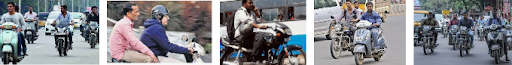
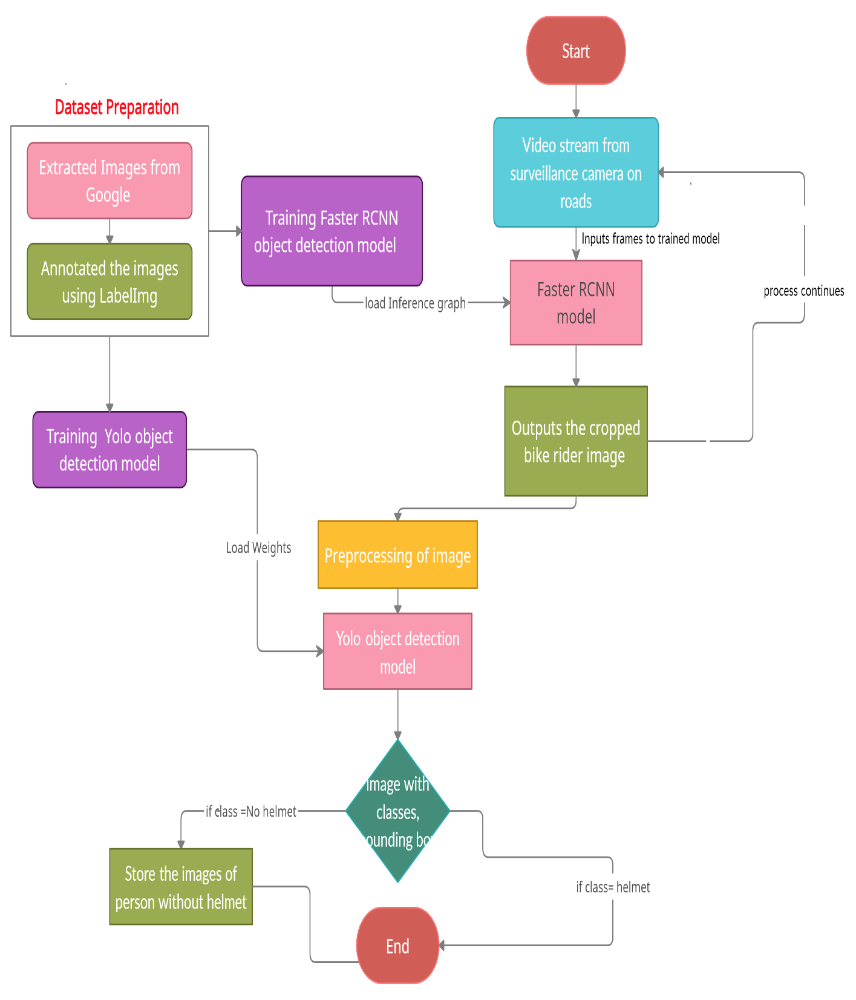
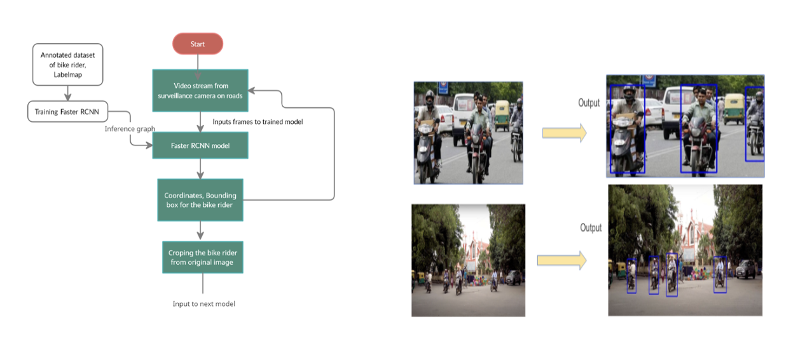
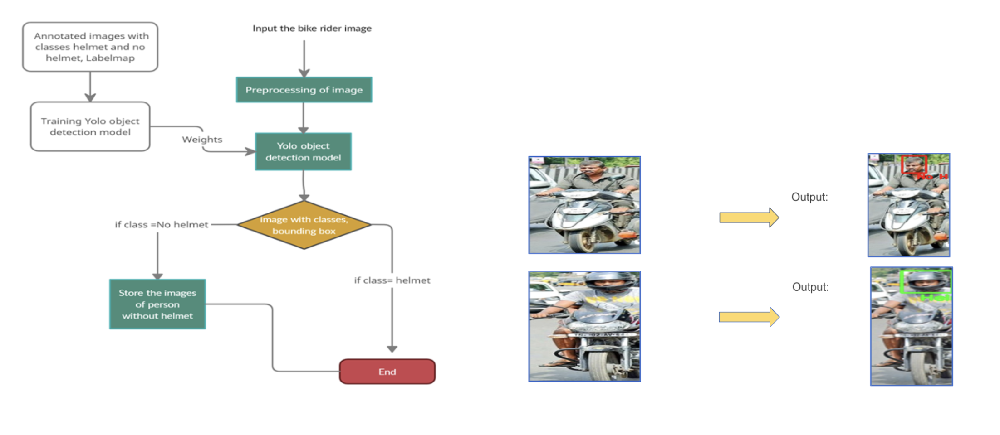
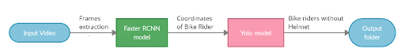

<h1 align="center"> Detection of Motorcyclists without Helmet </h1>  

  

  An automated end-to-end pipeline to detect traffic rule violators in real-time

<!-- START doctoc generated TOC please keep comment here to allow auto update -->
<!-- DON'T EDIT THIS SECTION, INSTEAD RE-RUN doctoc TO UPDATE -->
## Table of Contents

- [About the Project](#about-the-project)
- [Prerequisites](#prerequisites)
- [Dataset](#dataset)
- [High Level System Architecture](#high-level-system-architecture)
- [Training](#training)
- [Implementation](#implementation)
- [Results](#results)
- [Contributing](#contributing)

<!-- END doctoc generated TOC please keep comment here to allow auto update -->

## About the Project

Road accidents are rising daily, and in countries like India, many people die due to negligence carried while wearing helmets. In the present-day scenario, we encounter numerous death cases due to two-wheeler road accidents. Even though helmets are available everywhere, people are not wearing them. This work is to improve surveillance on the main roads in locations where the use of helmets is mandatory. There is a need for increased enforcement of traffic laws, particularly for offenses without automatic detection methods. The increase in the number of motorcyclists using helmets causes a decrease in the number of accidents with victims.

  

  

&nbsp;

The main objective of this project is to develop and implement a system that performs real-time helmet detection of bike riders using video surveillance, especially on main roads. Hence we can decrease the manual work of police, and even we can reduce the cost incurred for keeping our citizens safe by using this system as this software is built using free and open source technologies.

## Prerequisites

The following open source packages are used in this project:

* Python
* OpenCV
* Numpy
* Matplotlib
* Tensorflow, Tensorflow Object Detection API

## Dataset
### Bike rider Dataset
A dataset containing 739 images was collected from Google images using Web Scraping with the query “Biker riders wearing a helmet or no helmet.” This dataset is used for training the first module, and images are annotated using the ‘Labelmg’ tool. 

The dataset can be downloaded from [here](/HelmetDetection/dataset/bikerider-dataset.zip)

### Helmet Dataset

A dataset containing 764 images of 2 distinct classes from [kaggle](https://www.kaggle.com/andrewmvd/helmet-detection) is used for the second module. Bounding box annotations are provided in the XML format.

## High Level System Architecture

  

&nbsp;

The pipeline consists of two stages. The first stage involves the detection of bike riders from the images using the Faster RCNN model. In the second stage, cropped bike rider images are fed to the YOLO V3 model to check whether the bike rider is wearing a helmet.
### Pipeline Design 
#### FasterRCNN module

  

This module takes the input from the surveillance camera and breaks down the video stream into frames, and each frame is fed to a trained Faster RCNN model.  The model locates the bike rider with a bounding box. The original image will be cropped to the bike rider portion using the bike rider coordinates and fed to the next phase in the pipeline.

#### YOLOV3 module

  

This module takes the bike rider as input, preprocesses the image, and feeds it to YOLO Object Detection Model. The trained model locates the person's helmet and generates the bounding box along with the confidence value for each class. Suppose the object detection model identifies the person as not wearing a helmet; it saves the person's image, and police can manually or automatically generate the penalties by using other details in the picture, like a license plate.

#### Integration

  

The two models are integrated by designing an end-to-end pipeline capable of detecting the bike riders with and without a helmet from the video feed and storing the images of bike riders without a helmet in a folder.

## Training 

### FasterRCNN - Bikerider detection

1. Install Darknet framework 
2. Prepare  Dataset
3. Download pretrained weights
4. Configure files for training 
	- .config
	- .names
	- .data
5. Train the model

### YOLOV3 - Helmet detection

1. Install Darknet framework 
2. Prepare  Dataset
3. Download pretrained weights
4. Configure files for training 
	- .config
	- .names
	- .data
5. Train the model

## Implementation

The implemented pipeline can be found over [Detection_Of_Motorcyclists_Without_Helmet.ipynb](https://colab.research.google.com/drive/1Dfyi1ljVcVvrqiG55WokRcqmWzUM7XyD?usp=sharing).

## Results

  

The system can be used in real-time detection of traffic rule violators who ride bikes without using a helmet. The images of bike riders not wearing helmets are stored. This system can be installed in every surveillance camera on the main roads to assist the traffic police in detecting such violators in abnormal environmental conditions viz; hot sun, etc. Moreover, it can be extended to detect and report the license plates of violators. The license plate can be extracted using OCR and will allow the system to automatically send a penalty amount to the registered owner of the two-wheeler in case they are not wearing a helmet
The two models are integrated by designing an end-to-end pipeline capable of detecting the bike riders with and without a helmet from the video feed and storing the images of bike riders without a helmet in a folder.

## Contributing

Contributions are what make the open source community such an amazing place to be learn, inspire, and create. Any contributions you make are **greatly appreciated**.

1. Fork the Project
2. Create your Feature Branch (`git checkout -b feature/AmazingFeature`)
3. Commit your Changes (`git commit -m 'Add some AmazingFeature'`)
4. Push to the Branch (`git push origin feature/AmazingFeature`)
5. Open a Pull Request

Pull requests are welcome. For major changes, please open an issue first to discuss what you would like to change.